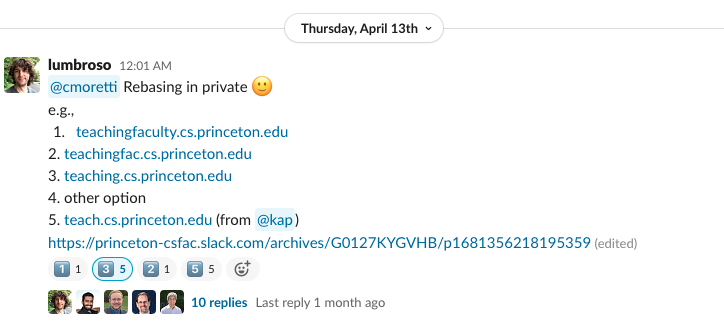

# Princeton CS Teaching Faculty Redirection

On April 13th, 2023, the Princeton CS teaching faculty voted for a domain for the group website. Initially, the results were inconclusive:

However, eventually, a member changed their vote, and the domain `teach.cs.princeton.edu` was chosen.

We allocated both domains however, and can redirect from `teaching.cs.princeton.edu` to `teach.cs.princeton.edu` automatically, using [GitHub Pages' custom 404 page feature](https://docs.github.com/en/pages/getting-started-with-github-pages/creating-a-custom-404-page-for-your-github-pages-site).
